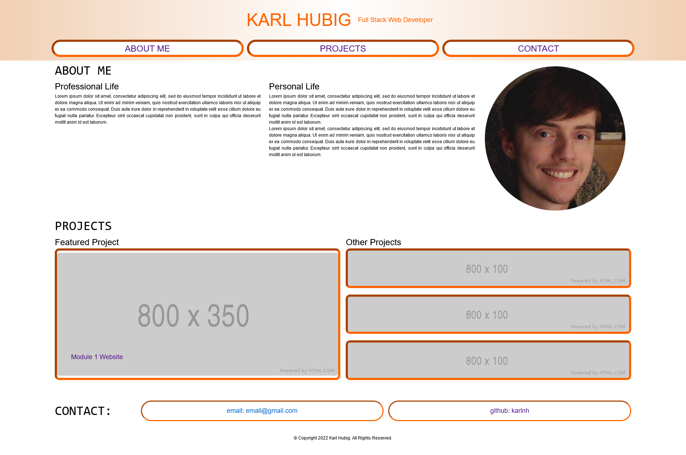

# Portfolio

[Link to application.](https://karlnh.github.io/uphill-wildcard/)

## Description

This website is intended to host all future projects for myself. It is designed to include personal and professional information and showcase my work as a blooming fullstack developer.

## Usage and Features

The website features a header with links that will navigate to the specified section. In the future it will feature images that will link to projects. There is also a section with contact information.

## Credits
I used [sir-sharkey's css-init](https://github.com/sir-sharkey/css-init) for the init.css file.

## License

This project is licensed under the [GNU General Public License v3](https://www.gnu.org/licenses/gpl-3.0.html).
